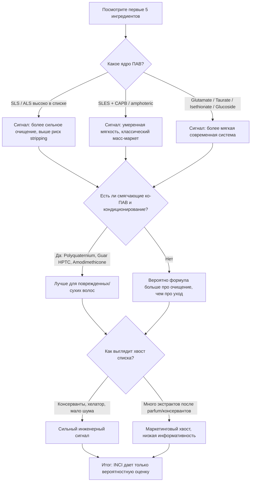

# Достаточен ли один INCI для оценки качества шампуня

## Executive summary

Короткий ответ: **нет, одного INCI недостаточно, чтобы надежно оценить качество шампуня**. По INCI можно довольно неплохо угадать **тип формулы** — насколько она, вероятно, мягкая или “жесткая”, есть ли у нее кондиционирующая логика, продумана ли система консервации, рассчитана ли она на поврежденные/окрашенные волосы или на сильное очищение. Но INCI **не раскрывает** ключевые параметры реального качества: точные концентрации в субпроцентной зоне, pH готового продукта, активную долю ПАВ, степень очистки сырья, происхождение и качество поставщика, устойчивость системы консервантов, фактическую микробиологическую и физическую стабильность, а также загрязнители и побочные примеси. citeturn3search4turn24search8turn17search2turn14search1turn16search0turn10search0

Самые информативные признаки в INCI для шампуня — это обычно **первые 3–6 ингредиентов** и, прежде всего, **система ПАВ**. Более мягкий сигнал обычно дают смеси вроде **Sodium Cocoyl Glutamate / Sodium Methyl Cocoyl Taurate / Sodium Cocoyl Isethionate / Coco-Glucoside / Decyl Glucoside / Sodium Lauroamphoacetate / Cocamidopropyl Betaine**. Более “жесткий” сигнал дают **Sodium Lauryl Sulfate** и **Ammonium Lauryl Sulfate** в начале списка; **Sodium Laureth Sulfate** чаще оказывается промежуточным случаем: обычно мягче SLS, но сам по себе еще не доказывает “высокое качество”. citeturn9search1turn9search11turn19search1turn20search13

Для поврежденных, пористых, окрашенных и спутывающихся волос положительным сигналом часто являются **катионные полимеры и/или силиконы с продуманным осаждением** — например, **Polyquaternium-10**, **Guar Hydroxypropyltrimonium Chloride**, **Amodimethicone**, **Dimethiconol**. Но и здесь нет универсального правила: то, что улучшает расчесывание и снижает трение на поврежденных волосах, может утяжелять тонкие волосы и создавать ощущение buildup. citeturn22search11turn22search19turn22search0turn11search10turn11search12turn11search5

Самые слабые маркеры качества в INCI — это обычно **длинные списки экстрактов в конце формулы**, “витамины/пептиды/аминокислоты” в хвосте списка, **Parfum**, **CI-красители**, а также pH-регуляторы вроде **Citric Acid** и **Sodium Hydroxide** без фактического значения pH. Для rinse-off продукта краткость контакта со скальпом и волосом особенно важна: многие заявляемые “активы” в шампуне клинически менее значимы, чем те же вещества в leave-on форме. citeturn23search9turn23search1turn17search2turn24search8

Практический вывод такой: **INCI позволяет делать только вероятностную, а не окончательную оценку качества**. Хорошая стратегия — использовать INCI для первичного отбора, а окончательную оценку строить на сочетании INCI, pH, сенсорики, данных о стабильности, переносимости, микробиологической защите и, при необходимости, лабораторных тестов. citeturn25search1turn14search1turn17search2

## Что такое INCI и где его пределы

INCI — это не “паспорт качества”, а **стандартизированная система имен ингредиентов**, которую в ЕС увязывают с общим глоссарием ингредиентов под эгидой entity["organization","Европейская комиссия","исполнительный орган Европейского союза"]. Для потребителя это прежде всего способ увидеть, **какие именно вещества присутствуют в продукте**, а не как хорошо они изготовлены, очищены, стабилизированы и в каких точных дозах они введены. citeturn4search1turn5search0

С точки зрения права ЕС этикетка косметики должна содержать **список ингредиентов**, причем ингредиенты выше 1% идут **в порядке убывания массы на момент ввода**, а ингредиенты ниже 1% могут быть перечислены **в любом порядке после них**. Наноматериалы должны быть специально помечены как **“(nano)”**, а красители — вынесены после остальных ингредиентов по **CI-номерам**. Это делает INCI полезным для грубой реконструкции формулы, но сразу ограничивает точность, как только вы заходите в хвост списка. citeturn3search4turn24search8turn5search0

Отдельный предел INCI связан с **отдушками**. В ЕС композиции запаха и ароматизаторы обычно обозначаются как **Parfum** или **Aroma**, а индивидуально должны раскрываться только определенные аллергенные компоненты при превышении порогов маркировки; для rinse-off продуктов это 0,01%, для leave-on — 0,001%. То есть INCI принципиально **не раскрывает рецептуру отдушки целиком**, хотя для чувствительной кожи и аллергиков отдельные маркеры все же появляются. citeturn3search1turn3search22

Еще один важный момент: INCI показывает **наличие ингредиента**, но почти никогда не показывает его **качественный класс**. Например, **Cocamidopropyl Betaine** в хорошем и плохом шампуне может называться одинаково, хотя степень очистки от примесей типа **DMAPA/amidoamine** и реальный раздражающий потенциал сырья будут разными. Аналогично **ethoxylated** ингредиенты могут нести разную нагрузку примесями вроде **1,4-dioxane**, а по INCI это обычно не видно. citeturn10search0turn10search1turn16search0turn16search2

## Что этикетка не раскрывает о реальном качестве

Главный аналитический пробел — **концентрация**. Да, порядок ингредиентов выше 1% информативен, но уже после этой границы INCI резко теряет разрешающую способность. Из списка нельзя надежно понять, введен ли **Panthenol** на 0,5% как meaningful-support ингредиент или на 0,05% как маркетинговый довесок; то же касается аминокислот, пептидов, растительных экстрактов и большинства “витаминов”. citeturn3search4turn23search9

Не менее важен **pH готового продукта**. Для волос это принципиально: более кислые шампуни обычно дают меньше статического электричества, меньше lifting кутикулы и меньше frizz, тогда как щелочные системы усиливают трение и повреждение волокна. Но из одного факта наличия **Citric Acid** или **Sodium Hydroxide** нельзя узнать фактический pH: эти вещества могут быть добавлены лишь в очень малом количестве для доводки. citeturn17search0turn17search2turn17search3

INCI ничего не говорит о **чистоте сырья и уровне примесей**. Это критично, например, для **Cocamidopropyl Betaine**, где клиническая аллергизация часто связывается не с самой бетаиной, а с остаточными примесями **DMAPA** и **amidoamine**; или для этоксилированных ингредиентов, где значима тема **1,4-dioxane** как побочного загрязнителя. По этикетке потребитель видит только имя ингредиента, но не видит его реальную химическую “аккуратность”. citeturn10search0turn10search1turn16search0turn16search2

INCI также не раскрывает **взаимодействия ингредиентов**. В шампунях именно взаимодействия решают очень многое: мягкость зависит не только от “имени ПАВ”, но и от того, как анионные ПАВ сочетаются с амфотерными и неионными; кондиционирование определяется не только наличием **Polyquaternium-10** или **Amodimethicone**, но и тем, насколько система образует **коацерват** и осаждает полезные компоненты на волосе при разбавлении водой. Это невозможно надежно прочитать из INCI без лабораторной или как минимум технологической информации. citeturn9search11turn22search11turn22search19

Отдельная слепая зона — **эффективность консервирующей системы**. Наличие консервантов в INCI еще не доказывает, что продукт защищен микробиологически: эффективность зависит от pH, воды, органической нагрузки, присутствия хелаторов, упаковки и совместимости с формулой. Именно поэтому для косметики используют preservative efficacy / challenge testing; одним INCI это не заменить. citeturn14search1turn18search1

Наконец, этикетка не раскрывает фактическую **стабильность, сенсорику и производственную дисциплину**: вязкость, пену, разброс по партиям, compatibility с упаковкой, устойчивость при хранении, склонность к расслоению и фактическую переносимость. А это уже и есть существенная часть реального “качества” продукта. citeturn25search0turn25search1

## Какие группы ингредиентов действительно несут смысловой сигнал

Ниже — **эвристическая**, а не юридическая матрица. Она суммирует, что по INCI действительно можно прочитать о формульной логике шампуня. Сигналы **условны**: “лучше” означает “чаще соответствует мягкой, современной, хорошо спроектированной rinse-off системе”, а не “всегда лучше для любого человека”. citeturn8search1turn9search11turn22search11turn11search10turn14search1

| Категория | Более сильные сигналы качества в INCI | Более слабые или условно неблагоприятные сигналы | Почему это важно |
|---|---|---|---|
| Анионные ПАВ | **Sodium Cocoyl Glutamate**, **Sodium Methyl Cocoyl Taurate**, **Sodium Cocoyl Isethionate**, **Disodium Laureth Sulfosuccinate** | **Sodium Lauryl Sulfate**, **Ammonium Lauryl Sulfate**; **Sodium Laureth Sulfate** — промежуточный случай | Для чувствительной кожи и окрашенных/сухих волос мягкие анионные ПАВ чаще лучше сохраняют барьер и снижают stripping; SLS обычно раздражает сильнее SLES. citeturn9search1turn19search1turn20search13 |
| Амфотерные ПАВ | **Cocamidopropyl Betaine**, **Sodium Lauroamphoacetate**, **Disodium Cocoamphodiacetate** | Отсутствие амфотерного ко-ПАВ при “жестком” анионном ядре | Амфотерики повышают мягкость и помогают балансировать систему, но CAPB требует хорошей очистки сырья. citeturn9search2turn10search0turn10search1 |
| Неионные ПАВ | **Decyl Glucoside**, **Coco-Glucoside**, **Lauryl Glucoside**, **Caprylyl/Capryl Glucoside** | Полное отсутствие мягких неионных/амфотерных со-ПАВ в sensitive-формуле | Глюкозидные ПАВ часто дают мягкость и более “современный” sulfate-free профиль, хотя иногда уступают по ощущению “чистоты” и пенообразованию. citeturn19search0turn9search11 |
| Ко-ПАВ / бустеры пены | **CAPB**, **amine oxides** в середине списка как часть системы | **Cocamide MEA**, особенно в очень простой SLS/SLES-системе; **Cocamide DEA** — устаревший/спорный сигнал | Ко-ПАВ могут улучшать пену и вязкость, но некоторые старые амидные бустеры чаще ассоциируются с более дешевыми или морально устаревшими системами. citeturn9search11turn21search3turn21search5 |
| Катионные кондиционирующие агенты | **Cetrimonium Chloride**, **Behentrimonium**-соли в малых дозах | Полное отсутствие катионного кондиционирования при заявке на гладкость/repair | Катионные агенты снижают статический заряд и улучшают расчесывание, но избыток может утяжелять тонкие волосы. citeturn22search11turn22search19 |
| Полимеры | **Polyquaternium-10**, **Polyquaternium-7**, **Polyquaternium-44**, **Guar Hydroxypropyltrimonium Chloride** | Отсутствие полимеров в supposedly conditioning шампуне; очень тяжелая film-forming система без учета типа волос | Именно полимерно-ПАВные коацерваты часто дают реальное кондиционирование в шампуне. citeturn22search0turn22search11turn22search19turn27search2 |
| Силиконы | **Amodimethicone**, **Bis-Aminopropyl Dimethicone**, **Dimethiconol**; PEG/PPG-модифицированные силиконы | Очень ранний **Dimethicone**/тяжелые нерастворимые силиконы без признаков balancing-системы | Amino-silicones лучше депонируются на поврежденных участках и хорошо кондиционируют; водонерастворимые силиконы могут накапливаться на части типов волос. citeturn11search10turn11search12turn11search5 |
| Масла и эфиры | Легкие эфиры и небольшие дозы масел как вспомогательные emollients | Длинный список “роскошных масел” в самом хвосте INCI | В rinse-off шампуне масла часто вторичны; если они далеко в списке, их вклад обычно сенсорный или маркетинговый, а не структурно значимый. citeturn11search10turn23search9 |
| Увлажнители | **Glycerin**, **Panthenol**, **Propanediol**, **Butylene Glycol**, **Pentylene Glycol** | Громкие claims при положении ингредиента в самом конце | Это хорошие вспомогательные компоненты, но в шампуне их эффект обычно умеренный и зависит от дозы/депонирования. citeturn23search9turn25search1 |
| Белки/пептиды | **Hydrolyzed Keratin**, **Hydrolyzed Wheat Protein**, **Silk Amino Acids**, **Arginine** | “Protein shampoo”/“peptide shampoo” при следовых дозах | Белковые гидролизаты могут помогать поверхности волоса, но rinse-off формат ограничивает эффект; гидролизованный пшеничный белок требует осторожности при аллергологической истории. citeturn12search0turn13search0turn13search2turn23search9 |
| Ботанические экстракты | Экстракт высоко в списке, либо стандартизованный актив с понятной логикой | Большой “садовый” список после консервантов/отдушки | Для шампуня длинные списки ботаники часто несут больше маркетинга, чем доказанного клинического вклада. citeturn23search1turn23search9 |
| Консерванты | Полная, реалистичная система консервации; **Phenoxyethanol**, органические кислоты в подходящей системе; иногда парабены как эффективный и обычно малосенсибилизирующий вариант | “Preservative-free” как универсальный плюс; кислоты без признаков подходящего pH | Водный шампунь должен быть надежно защищен; отсутствие “страшных” консервантов не равно лучшей защите или лучшему качеству. citeturn14search1turn15search1turn15search3 |
| Отдушки | Их отсутствие — плюс для очень чувствительной кожи | **Parfum** + длинный хвост аллергенов | Отдушка почти ничего не говорит о качестве очищения, зато может быть значима для чувствительных пользователей. citeturn3search1turn3search22 |
| Красители | Обычно нейтрально | Яркая окраска как суррогат “качества” | CI-красители — в основном эстетика, а не качество формулы. citeturn24search8 |
| Хелаторы | **Disodium EDTA**, **Tetrasodium EDTA**, **Sodium Phytate** | Их полное отсутствие в формуле, чувствительной к металлам/жесткой воде | Хелаторы повышают стабильность и могут усиливать действие консервантов; для hard-water пользователей это полезный сигнал. citeturn18search1turn18search15 |
| Регуляторы pH | **Citric Acid**, **Lactic Acid**, **Sodium Hydroxide** — нейтральный технологический признак | Попытка читать pH только по их наличию | Они говорят лишь о том, что pH подстраивали; финальное значение по INCI не видно. citeturn17search2turn24search8 |
| Загустители и растворители | **Sodium Chloride**, **Xanthan Gum**, **Cellulose Gum**, **Propylene Glycol** — обычно нейтрально | Считать их признаками премиальности/низкого качества без контекста | Это технологические компоненты; сами по себе почти ничего не говорят о качестве очищения или защите волос. citeturn25search1turn9search11 |
| Наноматериалы | Факт маркировки **(nano)** — это прежде всего регуляторный маркер | Считать само наличие/отсутствие nano признаком хорошего или плохого шампуня | В косметике ЕС nano-формы должны маркироваться, но для шампуня это редко и не является надежным маркером общего качества. citeturn5search0 |

## Что в INCI часто почти ничего не значит

Самый частый источник ошибки — **переоценка растительных экстрактов**. Если после **Phenoxyethanol**, **Sodium Benzoate**, **Potassium Sorbate**, **Parfum** или в самом конце списка стоят десятки экстрактов, то для rinse-off шампуня их вклад в качество обычно невелик или по крайней мере не может быть достоверно оценен снаружи. Для шампуня важнее структура ПАВ, pH и система кондиционирования, чем “экстрактный ореол”. citeturn3search4turn23search1turn23search9

Почти так же неинформативны **Parfum**, **CI-красители**, а также наличие **Citric Acid** или **Sodium Hydroxide** без фактического pH. Они могут быть технологически уместны, но сами по себе не дают ответа ни о мягкости, ни о реальном conditioning, ни о стабильности. citeturn24search8turn17search2

Фразы вне INCI вроде **“amino acid shampoo”**, **“keratin shampoo”**, **“detox”**, **“paraben-free”**, **“silicone-free”**, **“natural”**, **“microbiome-friendly”** — это уже не химическая номенклатура, а маркетинговые дескрипторы. Они могут совпадать с содержанием, а могут быть почти пустыми. По строгой аналитике гораздо важнее увидеть, **какие именно ПАВ стоят в начале списка, есть ли катионный полимер/силикон, есть ли хелатор и выглядит ли консервация реалистично**. citeturn9search11turn14search1turn18search1

## Практические эвристики для чтения INCI

Надежнее всего читать INCI как **дерево решений**, а не как список “хороших/плохих” слов. Сначала смотрите на ядро формулы, затем на систему кондиционирования, затем — на консерванты и только потом на “активы” и экстракты. Эта логика лучше соответствует тому, как шампунь реально работает. citeturn8search1turn9search11turn23search9

Несколько рабочих правил обычно полезнее любых “черных списков”:

1. **Первые 5 ингредиентов важнее последних 15.** В шампуне именно они обычно задают тип очищения и сенсорный профиль. citeturn3search4turn8search1  
2. **SLS/ALS высоко в списке** — сигнал более сильного очищения и нередко большего риска сухости/раздражения; для жирной кожи головы это не всегда плохо, но для сухих, окрашенных и пористых волос часто менее желательно. citeturn9search1turn6search1  
3. **SLES** — не “идеал” и не “зло”; он обычно мягче SLS, а итоговая мягкость сильно зависит от того, добавлены ли **CAPB**, amphoacetates, glucosides, glutamates и кондиционирующие полимеры. citeturn9search1turn9search11turn20search13  
4. **Amodimethicone / Polyquaternium-10 / Guar Hydroxypropyltrimonium Chloride** в середине списка часто сильнее предсказывают гладкость и легкое расчесывание, чем любые “масла” в хвосте списка. citeturn22search11turn22search19turn11search12  
5. **Хелатор** вроде **Disodium EDTA** или **Sodium Phytate** — недооцененный плюс: он помогает стабильности и лучше работает в условиях жесткой воды. citeturn18search1turn18search15  
6. **Экстракты, протеины, пептиды и аминокислоты после консервантов/отдушки** часто имеют слабую сигнальную ценность для rinse-off продукта. citeturn23search1turn23search9  
7. **Консерванты должны быть**, и их наличие — не минус само по себе. Более того, “без консервантов” для водной формулы не является признаком высокого качества. citeturn14search1turn15search1  
8. **Citric Acid на этикетке не означает automatically low-pH shampoo**: pH все равно неизвестен без измерения. citeturn17search2  

Полезно также различать **функциональное** и **маркетинговое** чтение состава. Ниже — сжатая карта “распространенность × информативность”, то есть где чаще всего спрятан реальный смысл INCI. Это аналитическая эвристика, а не статистика рынка. citeturn9search11turn22search11turn14search1turn23search9

| Высокая информативность | Низкая информативность |
|---|---|
| **Часто встречается:** SLES, CAPB, Polyquaternium-10, Disodium EDTA, Phenoxyethanol | **Часто встречается:** Aqua, Sodium Chloride, Parfum, CI-красители, Citric Acid |
| **Реже встречается, но очень полезно:** Sodium Cocoyl Glutamate, Sodium Methyl Cocoyl Taurate, Sodium Lauroamphoacetate, Amodimethicone | **Реже встречается и слабо предсказывает качество:** длинные ботанические смеси, trace peptides, “luxury oils” в хвосте |

Анонимизированные примеры помогают увидеть логику:

**Пример A**  
*Aqua, Sodium Laureth Sulfate, Cocamidopropyl Betaine, Sodium Chloride, Glycol Distearate, Polyquaternium-10, Dimethiconol, Guar Hydroxypropyltrimonium Chloride, Phenoxyethanol, Citric Acid, Parfum*  
Это выглядит как **добротный классический шампунь**: не ультрамягкий, но и не примитивный; есть ко-ПАВ, полимерное кондиционирование и силиконовый slip. Для очень чувствительной кожи головы не идеал, но для повседневного use-case это часто лучше, чем “экстрактный” sulfate-free шампунь без продуманного кондиционирования. citeturn9search11turn22search11turn11search10

**Пример B**  
*Aqua, Sodium Lauryl Sulfate, Ammonium Lauryl Sulfate, Cocamide MEA, Sodium Chloride, Parfum, CI 19140, CI 42090, Aloe Barbadensis Leaf Extract, Camellia Sinensis Leaf Extract*  
Такой INCI обычно сигнализирует **ставку на сильное очищение и дешевые технологические решения**, а не на мягкость или repair. Экстракты в самом конце не компенсируют “жесткое” ПАВ-ядро. Для очень жирной кожи головы продукт может работать по назначению, но как универсальный “качественный уход” он выглядит слабее. citeturn9search1turn9search11turn23search9

**Пример C**  
*Aqua, Decyl Glucoside, Sodium Cocoyl Glutamate, Sodium Lauroamphoacetate, Glycerin, Guar Hydroxypropyltrimonium Chloride, Panthenol, Sodium Benzoate, Potassium Sorbate, Citric Acid*  
Это уже сигнал **мягкой sulfate-free архитектуры**. Но финальная оценка все равно зависит от pH, силы консервации при такой кислотно-зависимой системе, вязкости и способности реально очищать жирную кожу головы. То есть INCI здесь обещает больше, чем в примере B, но качество все равно нельзя признать доказанным без данных по формуле. citeturn20search13turn14search1turn17search2

## Сводная таблица распространенных INCI-компонентов

Ниже — компактная таблица примерно по 30 частым ингредиентам. Это **сводный практический лист**, а не регуляторная классификация. Функции опираются на официальный глоссарий/obvious cosmetic use; сигналы качества — на обзоры по шампуням, данные по мягкости/раздражению, по коацервации/депонированию и по системам консервации. Диапазоны концентраций **очень ориентировочные** и в ряде случаев отражают типичную технологическую практику finished product, а не “чистое активное вещество”; INCI этого, разумеется, не раскрывает. citeturn4search4turn8search1turn9search11turn22search11turn14search1turn27search2

| INCI | Категория | Типичная функция | Сигнал | Уровень доказательности | Замечания по безопасности/качеству | Типичный диапазон |
|---|---|---|---|---|---|---|
| Sodium Laureth Sulfate | анионный ПАВ | основное очищение, пена | условно нейтральный | высокий | мягче SLS, но не гарантирует мягкость сам по себе | часто 5–15%+ |
| Sodium Lauryl Sulfate | анионный ПАВ | сильное очищение, пена | скорее − | высокий | более высокий риск dryness/irritation | часто 3–12% |
| Ammonium Lauryl Sulfate | анионный ПАВ | сильное очищение | скорее − | средний | чаще воспринимается как “жестче” для daily use | часто 5–15% |
| Cocamidopropyl Betaine | амфотерный ПАВ | смягчение системы, пена, вязкость | скорее + | высокий | хороший маркер blend-мягкости; качество зависит от очистки сырья | часто 2–10% |
| Sodium Lauroamphoacetate | амфотерный ПАВ | мягкое очищение, low sting | + | средний | хороший сигнал для sensitive/baby-style систем | часто 2–8% |
| Coco-Glucoside | неионный ПАВ | мягкое очищение, co-surfactant | + | средний | мягкий, но сам по себе иногда менее “моющий” по ощущениям | часто 2–10% |
| Decyl Glucoside | неионный ПАВ | мягкое очищение | + | средний | сильный маркер sulfate-free/mild формулы | часто 2–10% |
| Sodium Cocoyl Glutamate | мягкий анионный ПАВ | мягкое очищение | + | средний/высокий | один из лучших сигналов мягкости | часто 2–10% |
| Sodium Methyl Cocoyl Taurate | мягкий анионный ПАВ | мягкое очищение, пена | + | средний | обычно хороший компромисс mildness/foam | часто 2–10% |
| Disodium Laureth Sulfosuccinate | мягкий анионный ПАВ | очищение, пена | + | средний | обычно мягче типичных “жестких” сульфатов | часто 3–12% |
| Sodium Cocoyl Isethionate | мягкий анионный ПАВ | очищение, кремовая пена | + | высокий | хороший mildness marker; чаще встречается в bars и мягких жидких системах | часто 2–10% |
| Cocamide MEA | бустер пены/вязкости | пена, загущение | условно − | средний | не равен “плохому” качеству, но часто маркер более простой/старой архитектуры | часто 0.5–5% |
| Polyquaternium-10 | катионный полимер | кондиционирование, anti-static | + | высокий | хороший предиктор slip и облегчения расчесывания | часто 0.1–0.5% |
| Guar Hydroxypropyltrimonium Chloride | катионный полимер | detangling, anti-static | + | высокий | часто очень эффективен в rinse-off | часто 0.05–0.4% |
| Polyquaternium-7 | катионный полимер | мягкое кондиционирование | + | средний | хороший универсальный сигнал, но слабее/легче некоторых других | часто 0.1–1% |
| Cetrimonium Chloride | катионный кондиционер | anti-static, detangling | условно + | средний | полезен в малых дозах; избыток может утяжелять | часто 0.05–0.5% |
| Amodimethicone | силикон | targeted conditioning, reduced friction | + | высокий | сильный сигнал для поврежденных/окрашенных волос; buildup зависит от режима | часто 0.1–1% |
| Dimethicone | силикон | smoothing, slip, protection | условно нейтральный/+ | высокий | может отлично работать, но на части волос дает buildup/weight | часто 0.1–2% |
| Dimethiconol | силикон | film-forming, slip, shine | условно + | средний | сильный сенсорный plus, но тоже возможен buildup | часто 0.1–1% |
| Glycerin | humectant | удержание влаги, feel | условно + | средний | полезен, но в шампуне обычно не главный драйвер качества | часто 1–5% |
| Panthenol | humectant/pro-vitamin | moisturising, soothing support | условно + | средний | хороший вспомогательный ингредиент, не чудо-маркер | часто 0.1–1% |
| Hydrolyzed Keratin | белковый гидролизат | film-forming, support for damaged hair | условно + | средний | эффект в шампуне ограничен дозой и депонированием | часто 0.1–1% |
| Hydrolyzed Wheat Protein | белковый гидролизат | film-forming, conditioning | условно + | средний | есть редкие, но важные аллергологические caveats | часто 0.1–1% |
| Arginine | аминокислота | conditioning/claim support | нейтральный/условно + | низкий/средний | meaningful только при разумной дозе | часто 0.1–1% |
| Aloe Barbadensis Leaf Juice | ботанический экстракт | soothing/marketing support | нейтральный | низкий/средний | в конце списка обычно слабый маркер качества | очень вариабельно |
| Camellia Sinensis Leaf Extract | ботанический экстракт | antioxidant/claim support | нейтральный | низкий/средний | чаще маркетинговый хвост, чем core-quality marker | очень вариабельно |
| Phenoxyethanol | консервант | защита от микробов | скорее + | высокий | наличие реалистичной консервации — плюс; сам по себе не “плохой ингредиент” | часто ~0.3–1% |
| Sodium Benzoate | консервант | antimicrobials in acidic systems | нейтральный/условно + | высокий | зависит от pH и системы в целом | часто ~0.2–0.5% |
| Potassium Sorbate | консервант | mainly yeast/mold control | нейтральный/условно + | высокий | также pH-зависим | часто ~0.1–0.3% |
| Disodium EDTA | хелатор | связывание металлов, boost stability | + | высокий | полезный инженерный маркер, особенно при жесткой воде | часто 0.05–0.2% |
| Citric Acid | регулятор pH / хелатирующая поддержка | настройка pH | нейтральный | высокий | показывает только факт регулировки, не финальный pH | q.s. / малые дозы |
| Sodium Chloride | загуститель | регулировка вязкости | нейтральный | высокий | сам по себе почти ничего не говорит о качестве | часто 0.2–3% |

Практически полезное чтение таблицы такое: **плюс** чаще дается ингредиентам, которые либо повышают мягкость системы ПАВ, либо улучшают осаждение кондиционирующих компонентов, либо усиливают стабильность и защиту формулы. **Минус** чаще дается не “опасным” ингредиентам как таковым, а тем, что указывают на более грубую или менее изящную архитектуру формулы для повседневного использования. citeturn9search11turn22search11turn14search1

## Ограничения отчета и что проверять дополнительно

Даже лучший разбор INCI остается **косвенным методом**. Он не заменяет измерения **pH**, оценки **активной моющей системы**, тестов на **вязкость/реологию**, **пену**, **смачиваемость**, **detergency**, **сенсорику**, **легкость влажного и сухого расчесывания**, а также **ускоренные тесты стабильности**. Именно такие параметры фигурируют в лабораторных оценках качества шампуня и определяют реальный пользовательский опыт. citeturn25search0turn25search1

Если задача — доказать, что шампунь качественный, а не просто “красиво выглядит по INCI”, разумный базовый пакет тестов включает: измерение **pH**, **вязкости**, **массовой доли сухого остатка/активных ПАВ**, **микробиологическую чистоту**, **challenge test / preservative efficacy**, а при необходимости — тесты на загрязнители и примеси, такие как **1,4-dioxane** для этоксилированных систем или **DMAPA/amidoamine** для бетаиновых ПАВ. Для claims про damaged hair желательно добавлять тесты на **combing force**, трение и блеск на стандартных прядях. citeturn14search1turn16search0turn16search2turn10search0turn10search1

Итоговый вывод остается строгим: **INCI шампуня полезен для отсечения заведомо слабых или неподходящих формул, но недостаточен для надежной оценки качества как такового**. Наиболее сильные сигналы дает не “экзотика” в хвосте списка, а архитектура первых ингредиентов: **тип ПАВ, наличие мягких ко-ПАВ, полимерное/силиконовое кондиционирование, хелатор и реалистичная консервация**. Все остальное — особенно экстрактный хвост, vague claims и trace-активы — нужно считать вторичным, пока это не подтверждено дозой, pH, стабильностью и испытаниями. citeturn3search4turn9search11turn22search11turn18search1turn14search1turn23search9